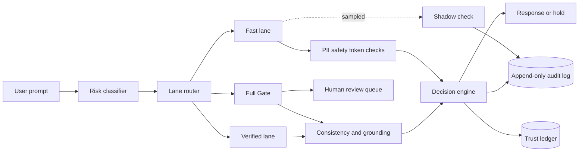

# ControlPlane.ai

ControlPlane is an adaptive trust gateway for AI applications. The same model can answer different questions through different trust lanes. Every request produces a decision, check results, trust score update, and append-only audit record.

The prototype demonstrates four routing concepts:

- Fast Lane for low-risk requests with trusted models
- Verified Lane for medium-risk requests that need semantic checks
- Full Gate for high-risk, low-trust, or ambiguous requests
- Shadow Lane for sampled asynchronous verification of Fast Lane traffic

## Project Structure

```text
controlplane/
├── README.md
├── requirements.txt
├── .env.example
├── controlplane.db
├── app/
│   ├── __init__.py
│   ├── main.py
│   ├── config_loader.py
│   ├── db.py
│   ├── ledger.py
│   ├── llm_client.py
│   ├── risk_classifier.py
│   ├── router.py
│   └── checks/
│       ├── __init__.py
│       ├── deterministic.py
│       └── heavy.py
├── config/
│   ├── customer_support.yaml
│   ├── internal_copilot.yaml
│   └── decision_support.yaml
├── corpus/
│   ├── customer_support_docs.json
│   ├── internal_copilot_docs.json
│   └── decision_support_docs.json
├── static/
│   ├── index.html
│   ├── app.js
│   └── style.css
└── tests/
		└── test_router.py
```

### Application Files

| File | Purpose |
| --- | --- |
| `app/main.py` | FastAPI application, request orchestration, routes, review queue, audit endpoints, and demo reset endpoint |
| `app/config_loader.py` | Loads YAML policies and manages runtime policy updates |
| `app/db.py` | Creates the SQLite tables and seeds the named demo model trust state |
| `app/ledger.py` | Reads trust scores, writes trust events, and creates audit hashes |
| `app/llm_client.py` | Calls Groq or OpenRouter when configured and provides a local deterministic fallback |
| `app/risk_classifier.py` | Classifies prompts into low, medium, or high risk using deterministic rules |
| `app/router.py` | Pure lane-routing function with cold-start and trust safeguards |
| `app/checks/deterministic.py` | PII, safety keyword, and token-baseline checks |
| `app/checks/heavy.py` | Self-consistency, corpus grounding, and heavy decision checks |

### Configuration and Data Files

| File or folder | Purpose |
| --- | --- |
| `config/*.yaml` | Per-use-case region, risk overrides, lane thresholds, latency budgets, and shadow sampling rates |
| `corpus/*.json` | Fixed source documents used by grounding checks |
| `controlplane.db` | Local SQLite database containing trust ledger, audit log, and review queue data |
| `.env.example` | Example environment variable names for hosted model providers |
| `requirements.txt` | Python dependencies |

### Frontend Files

| File | Purpose |
| --- | --- |
| `static/index.html` | Control room layout, prompt console, lane badge, metrics, review queue, policy editor, and audit inspector |
| `static/app.js` | Scenario presets, API calls, result rendering, policy updates, review actions, and audit inspection |
| `static/style.css` | Warm off-white, beige, red, olive, and gold visual system plus responsive layout rules |

### Test Files

| File | Purpose |
| --- | --- |
| `tests/test_router.py` | Unit tests for cold start, risk tiers, trust thresholds, and deterministic escalation |

## Requirements

- macOS, Linux, or Windows
- Python 3.10 or newer
- Internet access is optional for the local fallback mode
- An API key is optional. Hosted calls use Groq or OpenRouter when configured

## Installation

From the project directory:

```bash
cd /path/to/controlplane
python3 -m venv .venv
source .venv/bin/activate
python -m pip install --upgrade pip
pip install -r requirements.txt
```

On Windows PowerShell, activate the environment with:

```powershell
.venv\Scripts\Activate.ps1
```

## Environment Variables

The application works without environment variables by using the local deterministic synthesizer in `app/llm_client.py`.

For hosted model calls, export one of these variables before starting the server:

```bash
export GROQ_API_KEY="your-key"
```

or:

```bash
export OPENROUTER_API_KEY="your-key"
```

The internal audit store is intentionally privacy-forward: it writes the redacted response to the audit log instead of the original raw text. This preserves traceability for human review while avoiding retention of sensitive content in the local database record.

Never commit API keys to the repository. The `.env.example` file contains names only and does not contain credentials.

## Start the Application

Development mode with automatic reload:

```bash
uvicorn app.main:app --reload --host 127.0.0.1 --port 8000
```

Production-style local process:

```bash
uvicorn app.main:app --host 127.0.0.1 --port 8000
```

Open the browser at:

```text
http://127.0.0.1:8000
```

If port `8000` is already in use, start on another port:

```bash
uvicorn app.main:app --host 127.0.0.1 --port 8001
```

Then open `http://127.0.0.1:8001`.

## Demo Workflow

The UI is designed for a short live demonstration.

1. Open the application and click **Reset demo**.
2. Select **Customer Support Bot**.
3. Click **Store Hours**, then click **Route Request**. Confirm the green Fast Lane badge.
4. Click **Skin Compatibility**, then click **Route Request**. Confirm the amber Verified Lane badge and heavy semantic check.
5. Click **Account PII Query**, then click **Route Request**. Confirm the red Full Gate badge, blocked output, and pending review item.
6. Click the audit row for the request. Confirm that the output panel shows the final response, justification, and tamper hash.
7. Approve or reject the review item. Confirm that the trust ledger changes through a new event.
8. Click **Break It On Purpose** to demonstrate a deliberately unsafe response, trust impact, review routing, and audit evidence.
9. Edit the policy JSON, change a threshold, and click **Apply Policy**. The next request uses the updated policy without a server restart.

## Scripted Scenarios

Each use case has one expected scenario for each core lane.

| Use case | Fast Lane | Verified Lane | Full Gate |
| --- | --- | --- | --- |
| Customer Support Bot | What are your store hours? | Will this product work for someone with sensitive skin? | Look up my account using card number 4111-1111-1111-1111 |
| Internal Knowledge Copilot | What is our annual PTO policy? | Summarize last quarter's team performance | Should we terminate employee X? |
| Decision Support Tool | Define EBITDA | Estimate this account's churn risk | Should we approve this $2M loan application? |

The scripted lane result assumes the seeded demo model trust score is available. Click **Reset demo** before a fresh run. Other model IDs use the cold-start Full Gate policy.

## Architecture



## Request Lifecycle

1. The risk classifier checks the prompt with deterministic rules.
2. The ledger returns the latest model trust score.
3. The model generates a response through the hosted adapter or local fallback.
4. Deterministic checks scan the prompt and response for PII, unsafe keywords, and token anomalies.
5. The router selects Fast, Verified, or Full Gate.
6. Verified and Full Gate requests run heavy checks using generated samples and the local corpus.
7. The decision engine allows, edits, blocks, or holds the response.
8. Flagged Full Gate and Verified requests enter the review queue.
9. The audit log stores the complete request decision and check details.
10. Trust events update the append-only ledger with a previous hash and current hash.

## API Reference

### Execute a Request

```http
POST /api/execute
Content-Type: application/json
```

Example body:

```json
{
	"prompt": "What are your store hours?",
	"use_case": "customer_support",
	"model_id": "claude-sonnet-3-5"
}
```

The response includes the request ID, lane, risk tier, deterministic findings, heavy findings, decision action, final response, trust score, latency, and tamper hash.

### Reset the Demo

```http
POST /api/demo/reset
Content-Type: application/json
```

Example body:

```json
{
	"model_id": "claude-sonnet-3-5"
}
```

This clears local audit and review records for the named model and creates a new seeded genesis state at trust score `0.86`.

### Audit and Metrics

| Method and path | Description |
| --- | --- |
| `GET /api/audit_log` | Returns the latest audit records |
| `GET /api/audit_log/{request_id}` | Returns every stored check and decision for one request |
| `GET /api/dashboard_metrics` | Returns lane counts, latency, review approval proxy, shadow disagreements, and trust history |
| `GET /api/review_queue` | Returns recent human review items |
- `POST /api/review_queue/resolve` | Approves, rejects, or escalates a review item |
- `GET /api/health` | Returns service health and prototype version |

### Configuration

| Method and path | Description |
| --- | --- |
| `GET /api/config/{use_case}` | Returns the active policy for a use case |
| `POST /api/config/update` | Writes and activates a policy update |

The policy editor expects valid JSON. The backend writes the resulting object back to the matching YAML file.

## Policy Configuration

Each policy file defines a use case, region, risk overrides, latency budgets, trust thresholds, cold-start behavior, blast-radius cap, and shadow sample rate.

Example:

```yaml
use_case_id: customer_support
name: Customer Support Bot
region: EU
risk_category_overrides:
	pii: high
	financial_advice: high
trust_thresholds:
	fast_lane_min_score: 0.8
	full_gate_max_score: 0.4
cold_start_default_lane: full_gate
shadow_sample_rate: 0.15
blast_radius_cap: 0.03
```

## Persistence and Trust Model

The local database is `controlplane.db`. It contains three tables:

- `trust_ledger` stores append-only trust events and hash references
- `audit_log` stores one complete decision per request and links each record to the previous audit hash through `prev_hash` and `chain_hash`
- `review_queue` stores requests waiting for human action

High-confidence failures cause larger trust reductions. Low-confidence failures are bounded by the configured blast-radius cap. Human approval and sampled verification add small recovery increments. The hash chain is a prototype tamper-evidence mechanism and is not a regulatory-grade external anchor.

To start with a clean demo state, use the **Reset demo** button or call `POST /api/demo/reset`. Do not delete `controlplane.db` while the server is running.

## Testing and Validation

Run the router unit tests:

```bash
python -m unittest discover -s tests -v
```

Compile all Python files:

```bash
python -m compileall -q app tests
```

Validate frontend JavaScript syntax:

```bash
node --check static/app.js
```

Validate all YAML policies:

```bash
python -c "import yaml, pathlib; [yaml.safe_load(p.read_text()) for p in pathlib.Path('config').glob('*.yaml')]; print('YAML valid')"
```

For a complete live check, reset the demo and run the nine scripted prompts. The expected lane sequence for each use case is `FAST`, `VERIFIED`, `FULL GATE`.

## Troubleshooting

### Port 8000 is already in use

Use another port such as `8001` and open the matching browser URL.

### The application starts but the page is empty

Confirm that Uvicorn was started from the project directory. The application expects the `static`, `config`, and `corpus` folders relative to that directory.

### All requests route to Full Gate

Click **Reset demo**. A low trust score intentionally routes traffic to Full Gate. New model IDs also use the cold-start Full Gate path.

### Hosted model calls are not working

Confirm that the selected API key is exported in the same terminal used to start Uvicorn. The local fallback remains available when no key is present or a provider request fails.

### Policy changes are rejected

The editor accepts JSON, not YAML syntax. Use double quotes around string keys and values, and confirm that nested objects are properly closed.

### Favicon 404 appears in the server log

This is harmless. The application does not currently ship a favicon.

## Prototype Scope and Next Steps

The prototype uses a fixed local corpus, in-process asynchronous tasks, deterministic safety heuristics, and a local SQLite database. A production deployment would add queue-backed workers, a larger retrieval system, dedicated moderation and NER models, externally anchored audit storage, learned cost baselines, and continuous false-positive and false-negative measurement.
